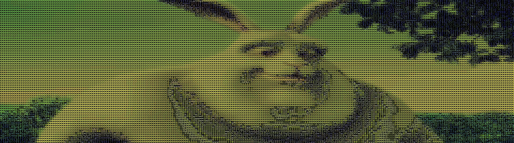
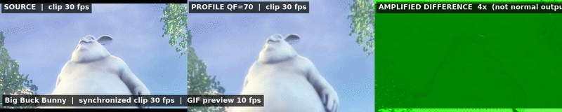
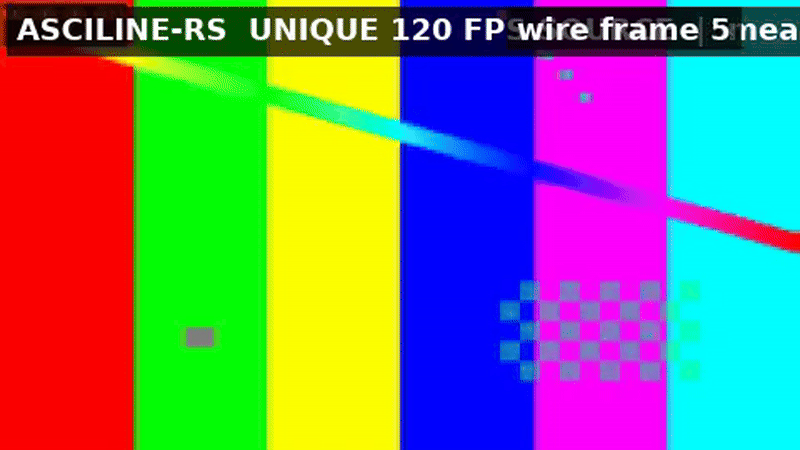

# ASCILINE · Rust

A Rust port of [ASCILINE](https://github.com/YusufB5/ASCILINE) — a real-time ASCII
video rendering engine. It decodes video, maps pixels to ASCII characters (or
colored blocks), compresses every frame with an adaptive codec
(RAW/ZLIB/DELTA/RLE_FULL), and streams it over WebSocket — or renders it
directly in a true-color terminal.

The wire protocol is **byte-compatible with the original**, so the unchanged
browser client (`web/`) works as-is against the Rust server. The codec is
verified bit-exact against both the original Python encoder (`codec.py`) and the
original JS decoder (`codec.js`) — see [Validation](#validation).

## Why Rust?

Beyond the port itself, this answers the question *"can ASCILINE run faster than
30 fps?"* — **yes**:

- the Python server hard-caps every source to ≤30 fps (`MAX_FPS = 30` + frame
  skipping) and runs decode → map → encode → send serially under the GIL;
- the Rust server has **no hard-coded 30 fps cap** (sources play at native
  rate, `--fps N` accepts any target), pipelines decode (dedicated thread)
  against map/encode (tokio blocking pool) and the WebSocket send, does the
  resize/decimation inside ffmpeg's SIMD filters, and parallelizes mapping over
  rows with rayon. There is no universal infinite-FPS guarantee: the practical
  ceiling depends on source decode, grid size, codec mode, CPU, and network.
  The published unique-frame benchmark reaches approximately 125/249/495 fps
  at 120/240/480 fps targets on this machine.

Measured on a 60 fps source, `asciline-server --fps 60` streams **59.3 fps**,
and the map+encode stage alone runs at a **~3,600 fps ceiling** at 240×67
(2.7× faster than the equivalent numpy+codec.py work). The high-rate unique-
frame throughput evidence is in the [sample benchmark](#unique-frame-throughput-proof);
details and tables are in **[PERF_ANALYSIS.md](PERF_ANALYSIS.md)**.

## Requirements

- Rust 1.87+ (`cargo build --release`)
- `ffmpeg` + `ffprobe` on `PATH` (used for decode, audio, and thumbnails — no C
  libraries, no OpenCV)

## Build

```bash
cargo build --release
# binaries: target/release/asciline-server  asciline-player  asciline-compile  asciline-render
```

## 1. Streaming server (drop-in for `stream_server.py`)

```bash
asciline-server video.mp4 --cols 240
asciline-server --folder videos --cols 200 --loop
asciline-server --playlist playlist.json --mode 4
asciline-server --webcam --cols 240
```

Open http://localhost:8000 — the original player UI, served from `web/`, works
unchanged (`INIT:` handshake, binary frames, `/audio` MP3, `/scrub` hover
thumbnails, pause/seek/filter/reinit commands, backpressure frame-dropping).

```
--mode 1-6     color quality (1=B&W … 6=16M colors)      default 1
--pixel        colored-block mode
--cols N       grid columns (default 200 text / 450 pixel)
--rows N       grid rows (0 = auto from aspect ratio)
--fps N        target streaming FPS (default: source rate — no 30 fps cap)
--quality {lossless,high,balanced,low}   lossy temporal delta for the codec
--vol 0-5      audio volume (0 = no ffmpeg audio run at all)
--loop         loop the queue
--playlist/--folder/--webcam   sources
--host/--port  bind address (default 127.0.0.1:8000)
--max-clients  concurrent WebSocket clients (default 8; each owns an ffmpeg +
               decode thread — overflow gets 503)
--max-ffmpeg   concurrent ffmpeg spawns for /audio + scrub builds (default 4)
--token SECRET optional auth: /ws, /audio, /scrub* require ?token=SECRET
--debug        RAW vs WIRE bandwidth logging
```

`RUST_LOG=info asciline-server ...` enables tracing lifecycle output; `GET
/healthz` reports liveness + client count for orchestrators.

### Production deployment

```bash
# Docker (binary + ffmpeg, non-root user, healthcheck)
docker build -t asciline-server .
docker run -p 8000:8000 -v /path/to/videos:/srv/asciline/videos \
  asciline-server --folder videos --cols 240 --loop

# note: with a bind mount, the host directory must be readable by the
# container's non-root `asciline` user (chmod o+rX /path/to/videos)

# install.sh (cargo build + copy to ~/.local/bin)
./install.sh
```

See [SECURITY.md](SECURITY.md) for the trust model: the server binds
`127.0.0.1` by default, checks WS `Origin` (anti-CSWSH), and enforces
connection/ffmpeg caps. Use `--token` (or the `ASCILINE_TOKEN` env var) and a
TLS-terminating reverse proxy when exposing it beyond localhost — there is no
built-in TLS.

For production: **[DEPLOYMENT.md](DEPLOYMENT.md)** covers systemd
(`deploy/asciline.service`), Docker Compose (`deploy/docker-compose.yml`,
with `.env.example`), a Caddy TLS proxy (`deploy/Caddyfile`), and capacity
tuning — all three are also shipped inside every release tarball.

## 2. Terminal player (`ascii_video_player2.py`)

```bash
asciline-player video.mp4 --cols 100          # true-color ANSI, source FPS
asciline-player --webcam --cols 100
asciline-player movie.ascf                    # plays compiled .ascf clips too
asciline-player video.mp4 -c 240 --fps 60     # 60 fps in the terminal
```

Zero-flicker rendering (hide cursor, disable wrap, `\x1b[H` + full-frame
rewrite), run-length-compressed `38;2;r;g;b` escapes, aspect-correct auto-fit
(`CHAR_RATIO 0.45`), palette + quantize options.

## 3. Compiler (`compiler.py`)

Also shipped: **`asciline-render`** — headless `.ascf` → PPM frame renderer
(pixel blocks / ASCII glyphs) for turning compiled clips into images and video:
`asciline-render clip.ascf --out frames && ffmpeg -framerate 30 -i frames/frame_%06d.ppm out.mp4`.

```bash
asciline-compile your_video.mp4 --cols 250 --pixel --quantize 2
asciline-compile your_video.mp4 --mode 6 --hard
asciline-compile your_video.mp4 --profile --qf 70   # smallest files (lossy DCT)
```

Writes the v2 `ASC2` container: 18-byte header + length-prefixed codec frames,
plus the extracted `*.mp3` audio track. Playable by `asciline-player`, the
original `static_player/`, and the Studio IDE. Options mirror the original:
`--cols/--rows/--mode/--pixel/--tolerance/--quantize/--hard/--out/--out-dir/--fps`.

### `--profile` — lossy DCT compression (tag 4)

The opt-in maximum-compression profile (a faithful port of `codec.py`'s
`ProfileEncoder`): frames become YUV 4:2:0, every 8×8 block is motion-compensated
(luma, ±3 integer search) and transformed with a deterministic **integer** DCT,
quantized with JPEG-style tables, and the non-zero zigzag coefficients are
run-length coded with DC DPCM — skipped blocks cost a single bit. It implies
`--pixel` and pads the grid up to multiples of 16.

```bash
asciline-compile clip.mp4 --profile --qf 40   # aggressive (smallest)
asciline-compile clip.mp4 --profile --qf 90   # near-lossless (largest)
```

`--qf` is the JPEG-style quality factor 1-100 (default 70). The decoded frames
are reconstructions — lossy, but decoded **bit-exactly by the original browser
decoder** (`codec.js` `makeProfileDecoder`) and by `asciline-player`. Measured
on a 720p clip at 320 cols: **0.34 MB vs 2.64 MB** for the lossless adaptive
pixel profile (~8× smaller).

Every `--profile` compile ends with a **quality report** — how far the lossy
reconstruction drifts from the source, averaged over all frames (mean, min,
max): **PSNR-Y** and **SSIM-Y** on the luma planes the DCT actually transforms
(standard codec metrics), plus **PSNR-RGB** on the full displayed pixels (which
also captures the 4:2:0 chroma subsampling and quant-table error):

```
[Quality] Lossy DCT reconstruction vs source (300 frames, QF=70):
[Quality]   PSNR-Y   39.47 dB   (min  37.57 / max  40.36)
[Quality]   SSIM-Y   0.9827      (min 0.9752 / max 0.9858)
[Quality]   PSNR-RGB 26.58 dB   (min  25.50 / max  28.82)
[Quality]   worst frame #60    PSNR-Y  35.37 dB  (SSIM 0.9105 / RGB 31.05 dB)
```

SSIM is the standard Wang et al. metric (11×11 Gaussian window, σ=1.5) in
`src/quality.rs`. Unsurprisingly, PSNR-RGB runs well below PSNR-Y — the chroma
planes are subsampled 2:2 and quantized with the much coarser JPEG chroma
tables, so color fidelity is the binding constraint, exactly as in the original.
Lossless frames (e.g. a fully static segment) show as `∞`. The `worst frame`
line names the weakest frame (lowest PSNR-Y, with its own SSIM/RGB) — in
practice this is a scene cut or a motion burst that lands between keyframes
(cuts exactly on a keyframe boundary re-encode cleanly and won't show up). The
report is computed with a rayon-parallel Gaussian blur that scales with cores
(it is the single biggest per-frame cost when enabled — measured ~60% of
compile instructions — so parallelizing it matters); `--no-quality` now
skips the SSIM computation entirely, not just the printed lines, which makes
scripted batch compiles ~2x faster still.

**Scene-cut keyframes (on by default):** `--profile` compares each frame's
luma against the previous reconstruction and, when the mean absolute
difference exceeds a hard cut threshold (`SCENE_CUT_MAD`, a threshold that
normal in-clip motion never reaches), re-encodes the frame as a fresh
keyframe instead of a stale motion-predicted inter frame. Keyframes are
self-describing, so every ASCILINE decoder handles them at any point in the
stream. This both **fixes the worst-frame quality collapse at cuts** and
usually **shrinks the file** — the frames after the cut no longer chase a
stale prediction (measured: worst frame at a cut goes 35.4 → 36.7 dB while
the 4s clip drops from 172 KB to 164 KB, including the extra keyframe).
`--no-scene-cut` restores the original fixed-cadence behavior; the detector
is off by default inside the library so the encoder stays bit-exact with
`codec.py` unless the compiler enables it.

The encoder itself is **parallelized with rayon**: every 8×8 block (motion
search, prediction, DCT, quantization, skip decision, reconstruction) is
computed independently in a parallel phase, then a serial phase assembles the
skip mask, motion vectors and the DC-DPCM'd zigzag stream in raster order
(the DPCM predictor chain is inherently serial). The RGB↔YUV conversions and
the report's SSIM blur are parallel too (the blur batches all five windowed
moments into one pass and uses mirror-index LUTs instead of per-pixel
`rem_euclid`). zlib uses flate2's pure-Rust `miniz_oxide` backend — measured
(`experiments/compare_zlib_backends.sh`) to produce ~23% smaller `.ascf` files
than `zlib-rs` on the adaptive pixel path at the same level, with the profile
path a wash and no meaningful speed difference either way.
Output is bit-identical regardless of thread count — verified by a
determinism test (1 vs 8 threads) and by the cross-implementation vectors.
Measured on a 15 s 720p clip at 480 cols (450 frames, 12 cores): **~31 s →
~17 s** with the quality report, and **~4.4 s** with `--no-quality` (which
now skips the SSIM computation, not just its printed lines).

`--quality-threshold N` turns the report into a **CI quality gate**: the
compile exits non-zero when the mean PSNR-Y of the lossy reconstruction falls
below N dB (requires a lossy compile and the quality report).
Note: combining `--profile` with `--quantize` measures against the
pre-quantized source, so the color numbers then look better than they would
against the original video.

The **adaptive pixel** path prints the same report whenever `--tolerance`
(temporal colour drift) or `--quantize` (colour depth) makes it lossy —
compared against the **original video frame** (not the quantized input), so
both loss sources show up (the comparison is the codec's *shown* framebuffer,
what players actually display after delta skipping). In pixel mode `--tolerance`
applies to every colour channel, exactly like `codec.py`; the ASCII mode's
character plane stays exact but that path doesn't print a report:

```
[Quality] Adaptive pixel reconstruction vs source (120 frames, tolerance=8, quantize=2):
[Quality]   PSNR-Y   41.24 dB   (min  39.15 / max  43.36)
[Quality]   SSIM-Y   0.9821      (min 0.9704 / max 0.9921)
[Quality]   PSNR-RGB 40.43 dB   (min  38.32 / max  42.66)
[Quality]   worst frame #63    PSNR-Y  39.15 dB  (SSIM 0.9704 / RGB 38.32 dB)
```

A `∞` result is honest, not a bug: when every cell exceeds the tolerance (fast
motion) or full-frame encoding wins the race, the codec genuinely loses
nothing. Lossless compiles (`--pixel` with tolerance 0 / quantize 0) skip the
report entirely.

One nuance: the encoder's forward DCT uses plain f64 loops where `codec.py`
runs numpy/BLAS, so on rare rounding or tie boundaries it may select slightly
different coefficients or motion vectors than the Python encoder. Both streams
are valid and decode identically on every ASCILINE decoder — compatibility is
in the bit-exact decode direction, which is what the tests verify.

## Sample clips — format evidence

The original project demonstrates its output with stills; here is the same
comparison for this port, rendered **by our own decoders**: `asciline-render`
headlessly rasterizes the compiled `.ascf` (pixel mode = coloured blocks, ASCII
mode = the palette characters in an 8×8 bitmap font) straight from the codec
frames a player would decode. Source: an 8 s, 640×360 excerpt of the
Creative-Commons-licensed **Big Buck Bunny** cartoon; attribution and
checksums are in [`samples/SOURCE.md`](samples/SOURCE.md).

| Output | What it is | File |
| :--- | :--- | :--- |
|  | original cartoon source | — |
|  | ASCII mode (mode 4) | `samples/big_buck_bunny_ascii.ascf` |
|  | PIXEL mode (lossless adaptive) | `samples/big_buck_bunny_pixel.ascf` |
|  | `--profile` lossy DCT, QF=70 | `samples/big_buck_bunny_profile.ascf` |

The GitHub-native animated comparison is below. It uses the same cartoon
frames in all three panels:


For a less compressed view, use the larger two-panel comparison and center-detail
inspection:


Play the samples yourself:

```sh
asciline-player samples/big_buck_bunny_profile.ascf   # terminal player
asciline-render samples/big_buck_bunny_profile.ascf --out frames \
  && ffmpeg -framerate 30 -i frames/frame_%06d.ppm out.mp4
# the original static_player/ and Studio IDE also open .ascf files
```

The `--profile` file is the headline: it retains recognizable cartoon detail
while using substantially fewer bytes — **9.78 MB lossless pixel → 346 KB
profile (~28× smaller)** on this 8-second excerpt. The exact PSNR/SSIM report, including
the worst frame, is in
[`samples/big_buck_bunny_profile_quality.txt`](samples/big_buck_bunny_profile_quality.txt).
The QF=40/70/90 size-quality trade-off is:

| QF | Profile size | Pixel/profile | PSNR-Y | SSIM-Y | PSNR-RGB |
|---:|---:|---:|---:|---:|---:|
| 40 | 216,929 B | 45.1× | 33.80 dB | 0.9432 | 30.21 dB |
| 70 | 346,405 B | 28.2× | 36.47 dB | 0.9670 | 32.13 dB |
| 90 | 684,437 B | 14.3× | 41.14 dB | 0.9861 | 34.57 dB |

The generated matrix is also available at
[`samples/big_buck_bunny_quality_matrix.md`](samples/big_buck_bunny_quality_matrix.md).

### Speed versus playback rate

The comparison video is synchronized: every panel has its own **30 fps display
label** because all three outputs preserve the source clip's playback rate.
Offline compile speed is a separate measurement:

| Format | Display FPS | Compile FPS | Output |
|---|---:|---:|---:|
| ASCII mode | 30 | 216.2 | 2,620,569 B |
| PIXEL lossless | 30 | 111.1 | 9,779,783 B |
| PROFILE QF=70 | 30 | 190.5 | 346,405 B |
| PROFILE QF=70, no quality report | 30 | 292.7 | 346,405 B |

These are representative measurements on the pinned 240-frame excerpt; compile
FPS means frames processed per wall-second, not playback FPS. The full report
and rerun script are [`samples/big_buck_bunny_speed_analysis.md`](samples/big_buck_bunny_speed_analysis.md)
and `experiments/measure_sample_speed.sh`. GIFs are intentionally downsampled
previews and must not be used to compare playback speed; use the synchronized
MP4s and this table.

### Real video artifacts

The full-resolution MP4 artifacts prove the claims that stills cannot, while
these GIFs are the versions GitHub can display inline:

- 
- 

See [`samples/README.md`](samples/README.md) for an evidence guide,
quality-metric definitions, and reproduction methodology.

| Video | What it shows |
| :--- | :--- |
| [`samples/evidence/cartoon_compare.mp4`](samples/evidence/cartoon_compare.mp4) | SOURCE \| PIXEL \| PROFILE side-by-side at **240 columns** (3× the still resolution), 30 fps, labels + measured PSNR burned into each frame |
| [`samples/evidence/cartoon_profile.mp4`](samples/evidence/cartoon_profile.mp4) | profile-only reconstruction at 30 fps |
| [`samples/evidence/cartoon_difference.mp4`](samples/evidence/cartoon_difference.mp4) | source, profile, and explicitly 4× amplified difference panels |
| [`samples/evidence/cartoon_wire_120fps.mp4`](samples/evidence/cartoon_wire_120fps.mp4) | actual WebSocket wire frames from 60 fps cartoon content, useful as a transport illustration |

### Unique-frame throughput proof

The visual and numerical proof for the substantial FPS claim is separate from
cartoon quality. The inline GIF shows actual wire frames from a genuine 120 fps
source with a live wire-frame counter:



The full MP4 is [`throughput_120fps.mp4`](samples/evidence/throughput_120fps.mp4).

Every source frame is checked with `framemd5`, and the benchmark records source
frames, unique hashes, server-sent frames, and timestamp-derived wire rate:

| Target | Unique source frames | Server sent | Measured wire rate |
|---:|---:|---:|---:|
| 60 | 240 | 240 | 61.9 fps |
| 120 | 480 | 480 | 124.9 fps |
| 240 | 960 | 960 | 249.3 fps |
| 480 | 1,920 | 1,920 | 494.7 fps |

This proves the current machine delivered **unique frames above 60 fps**,
including 120/240/480 fps targets. It is a measured benchmark, not an
unlimited guarantee on every machine; the practical ceiling depends on source
decode, grid size, codec mode, CPU, and network. Full methodology and logs:
[`samples/README.md`](samples/README.md),
[`samples/evidence/throughput_matrix.md`](samples/evidence/throughput_matrix.md),
and [`samples/evidence/throughput_benchmark.log`](samples/evidence/throughput_benchmark.log).

The samples are committed; regenerate visual quality artifacts with
`experiments/make_samples.sh` and throughput artifacts with
`experiments/measure_throughput.sh`.

## Architecture

```
┌─────────────┐  pipe: raw RGB24   ┌──────────────┐  bounded    ┌──────────────────────┐
│ ffmpeg child│  (cols×rows×3/frame)│ decode thread│  channel   │ async task:          │
│ scale+fps   │──────────────────▶│ (FrameReader)│───────────▶│ map (rayon) + adaptive│
│ filters     │                    │              │            │ encode (blocking pool)│
└─────────────┘                    └──────────────┘            │ + pacing + WS send    │
                                                               └──────────────────────┘
```

- `src/video.rs` — ffprobe probing + ffmpeg `rawvideo` pipe decoding
- `src/mapper.rs` — pixel → `[char,R,G,B]` / `[B,G,R]` framebuffers (row-parallel)
- `src/codec.rs` — adaptive encoder + decoder (RAW/ZLIB/DELTA/RLE_FULL, keyframes)
- `src/profile.rs` — tag-4 lossy DCT profile encoder + decoder (motion search,
  integer DCT, zigzag RLE, DC DPCM) — used by `--profile` and `.ascf` playback
- `src/quality.rs` — PSNR / SSIM (Gaussian-window) metrics for the `--profile`
  quality report
- `src/filters.rs` — gray LUT (brightness/contrast/gamma/invert) + unsharp mask
- `src/protocol.rs` — INIT handshake, `.ascf` container
- `src/server.rs` — axum HTTP + WebSocket streaming pipeline
- `web/` — the original frontend, served as-is

## Validation

```bash
cargo test                    # 53 tests: 41 unit + 12 malformed-input fuzz/proptests
                              # (codec + profile round-trips incl. DELTA wire format,
                              #  tolerance semantics, scene-cut keyframes, thread-count
                              #  determinism, decoder hardening regressions, …)

`asciline-compile --profile --quality-threshold 35 clip.mp4` # fail CI if mean PSNR-Y < 35 dB

# Cross-implementation, bit-exact codec checks (adaptive):
python3 experiments/gen_python_vectors.py > experiments/vectors_python.bin
cargo test --test decode_python_vectors -- --ignored    # Rust decoder ↔ Python codec.py
node experiments/check_rust_vectors.js                  # Rust encoder ↔ shipped codec.js
# (the vector generator includes mostly-static cases so the DELTA wire path is
#  exercised in both directions — the original harness never emitted deltas)

# Cross-implementation, bit-exact codec checks (tag-4 lossy DCT profile):
python3 experiments/gen_profile_vectors.py > experiments/vectors_profile_py.bin
cargo test --test decode_profile_vectors -- --ignored  # Rust ProfileDecoder ↔ Python ProfileEncoder
cargo test --test roundtrip_profile -- --ignored       # Rust ProfileEncoder round-trip + vectors
node experiments/check_profile_vectors.js              # Rust ProfileEncoder ↔ shipped codec.js

cargo test --test e2e_server -- --nocapture             # boots the real server, WS INIT + frames,
                                                         # plus the hardening guards (healthz, token 401s,
                                                         # --max-clients 503)
cargo test --test load_server                           # --max-clients under real contention
                                                         # (overflow rejected, slot reuse after disconnect)
cargo test --test fuzz_malformed                        # proptest: no input may panic a decoder

# libFuzzer harnesses (nightly + clang): the same guarantee with a mutation
# engine, seeded from real compiled frames (fuzz/corpus, regenerated by
# experiments/make_fuzz_corpus.sh)
cargo +nightly fuzz build
cargo +nightly fuzz run fuzz_ascf_stream -- -max_total_time=30

cargo test --release --test bench_encode -- --ignored --nocapture   # map+encode benchmark
python3 experiments/bench_python.py                     # same benchmark for the Python stage
node experiments/fps_count.js <port> 3                  # measure live streamed fps
```

## Not ported / differences

- `yt-dlp` / YouTube URL playback (local files, folders, playlists, webcams only)
- the Python server's interactive `/help` command loop

See [NOTICE](NOTICE) for frontend attribution and the license.
